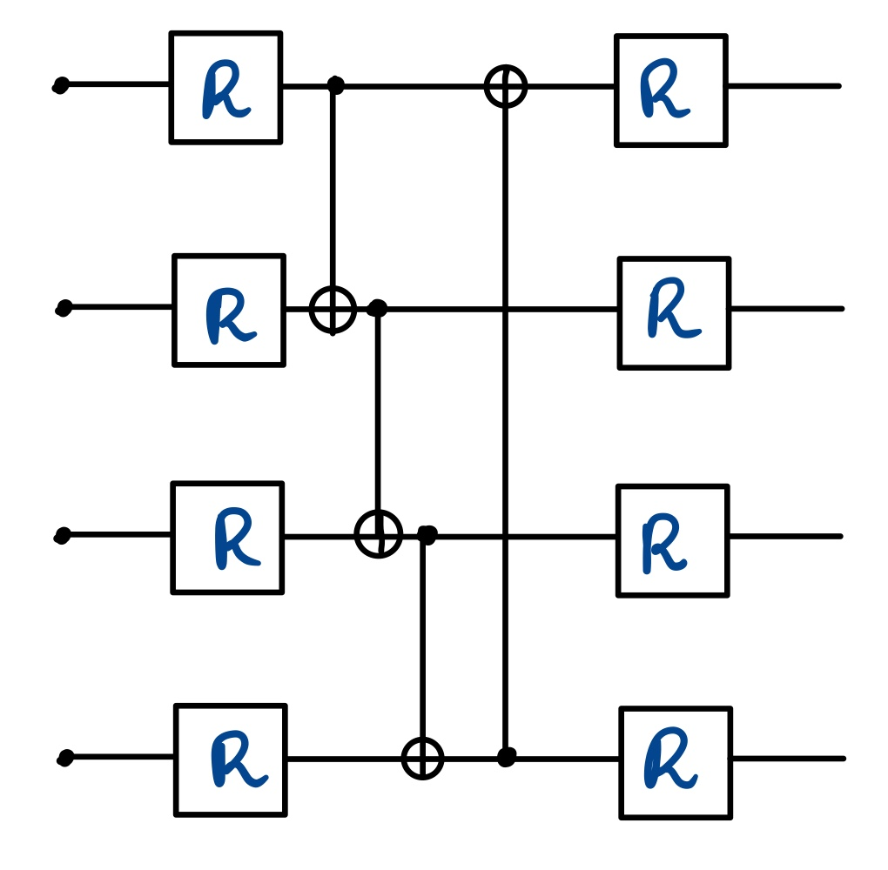

# Task 2 Report

## Problem Statement

To train a quantum variational circuit that will transform according to the following map:

$$f(\ket{0000}) = \ket{0011}\\
f(\ket{0001}) = \ket{0101}\\
f(\ket{0010}) = \ket{1010}\\
f(\ket{0011}) = \ket{1100}\\
$$

The input states were chosen arbitrarily, and the output states were fixed. The transformation for other states is irrelevant.

Framework used → Pennylane

## Brief on QVC

QVCs are the prime example of the intersection between quantum computing and classical machine learning. 

> A quantum circuit can be taken as a model with parameters of different kinds that can be trained for a transformation

There are two kinds of parameters:

- Adaptable $\hat\theta \rightarrow (\theta_1,\cdots \theta_n)$
- Non-adaptable $\hat x \rightarrow (x_1,\cdots x_n)$

The whole circuit can be modeled as one single unitary transformation that is parameterized by these parameters, and the transformation can be written as: $U(\hat\theta, \hat x)$

### Observables and Target

To use machine learning, we need to convert the qubit states into classical information. For this, we shall use observables. To maximize the distance between the possible outputs, we use `PauliZ`, which has $\{-1, 1\}$ as the observable values.

***Note:** We also need to convert the target values into the above format to draw reasonable accuracy and cost.*

---

## Circuit

The circuits' gates can be thought of as hyperparameters that do not change while they are being trained. To capture the function's entire essence, we need to have both single qubit and multi-qubit gates.

The circuit used is:

The `CNOT` gates were required to count for the relation between different qubits.

A saturation at $1.4$ cost was observed with one layer of `R` gates and `CNOT` gates.

Adding another layer of `R` gates dropped the cost to $0.6$. 

Each `R` gate takes in 3 parameters:

$$R(\theta, \phi, \omega)$$

### Embedding

Before the input can be fed into the circuit, it must be converted into a state. We will use the basis embedding:

$$0000 \rightarrow \ket{0000}$$

The kind of embedding determines the non-adaptable parameters of the circuit.

### Cost function

Since the distance between the predicted state and the required state directly can't be made, we instead apply our loss function over the expected value of the observable `PauliZ`

## Training the Transformation

The QVC algorithm is now used to train the circuit, i.e. find the correct parameters for each of the gates.

The parameters can be modeled into a weight matrix $W$

### Initialization

The initial values of the matrix are set to small random values.

### Optimization

The weight matrix will now have to be optimized to reduce the cost, for which we will use gradient descent paired with Nesterov Momentum optimization

The learning rate was initially set to $0.5$ which did not give low cost due to a great amount of fluctuation in the parameters. The rate was then gradually reduced and decent results were obtained at $0.01$ learning rate.

> After $200$ iterations the final cost was $0.6856744$ with full accuracy

## Testing

After the network was trained, it was tested for all the $16$ possible classical inputs to the circuit. For visualization, it is easier to scatter plot both the prediction and the expected value. The plot will also help us draw insights about the states' transformations that aren't considered on the map.

The diagram shows a recurring pattern since the training samples had only the first 4 points. The rest of the values are adjusted accordingly, and the pattern is repeated.

The graph doesn't change when run multiple times, that means the function generated is not random for the other points but is deterministic based on the training samples.
